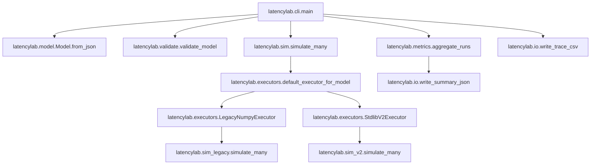

# LatencyLab Architecture

This document describes the current LatencyLab architecture, with emphasis on:

- v1 semantic stability (legacy compatibility)
- v2 additive-only model extensions (MVP: delayed wiring + task metadata)
- strict dependency boundaries (stdlib-only core, optional legacy NumPy path)
- executor abstraction boundary for future CPU/GPU batch execution strategies

## Non-negotiable invariants

1. **Any valid v1 model must preserve meaning and results** when executed through the v1 legacy path.
   - Golden output regression is enforced in [`tests.test_determinism.test_v1_outputs_are_stable_golden_snapshot()`](tests/test_determinism.py:31).
2. **The simulation facade is stdlib-only**.
   - Public entrypoint [`latencylab.sim.simulate_many()`](latencylab/sim.py:14) is stdlib-only and chooses an executor.
3. **GPU awareness is an execution strategy, not a domain concept**.
   - Core simulation logic never branches on CPU vs GPU.
   - GPU can be introduced by adding another executor implementing the same protocol.
4. **Delayed events are visible and attributable**.
   - v2 delays appear in trace output and in critical-path strings as synthetic delay nodes.

## High-level shape

The system is organized into:

- Model parsing/types: [`latencylab.model.Model.from_json()`](latencylab/model.py:70)
- Validation: [`latencylab.validate.validate_model()`](latencylab/validate.py:10)
- Simulation facade: [`latencylab.sim.simulate_many()`](latencylab/sim.py:14)
- Executors (strategy boundary): [`latencylab.executors.RunExecutor`](latencylab/executors.py:10)
- Execution engines:
  - v1 legacy (NumPy-backed): [`latencylab.sim_legacy.simulate_many()`](latencylab/sim_legacy.py:62)
  - v2 stdlib-only: [`latencylab.sim_v2.simulate_many()`](latencylab/sim_v2.py:43)
- Metrics aggregation: [`latencylab.metrics.aggregate_runs()`](latencylab/metrics.py:36)
- I/O writers: [`latencylab.io.write_trace_csv()`](latencylab/io.py:47)
- CLI orchestration: [`latencylab.cli.main()`](latencylab/cli.py:35)

### Mermaid overview

## SOLID boundaries (what depends on what)

### Dependency inversion at the executor boundary

- The rest of the application calls the simulation facade [`latencylab.sim.simulate_many()`](latencylab/sim.py:14).
- The facade selects an executor using [`latencylab.executors.default_executor_for_model()`](latencylab/executors.py:69).
- Executors implement the protocol [`latencylab.executors.RunExecutor`](latencylab/executors.py:10) and can be swapped without changing model semantics.

This is the insertion point for future batch optimizations, including GPU execution.

### Single responsibility

- Parsing/types in [`latencylab/model.py`](latencylab/model.py:1) do not run simulation.
- Executors in [`latencylab/executors.py`](latencylab/executors.py:1) only select and delegate.
- Engines in [`latencylab/sim_legacy.py`](latencylab/sim_legacy.py:1) and [`latencylab/sim_v2.py`](latencylab/sim_v2.py:1) implement run semantics.
- Metrics in [`latencylab/metrics.py`](latencylab/metrics.py:1) do not influence scheduling.

### Open/closed

- New execution strategies (future GPU executor) are added by implementing [`latencylab.executors.RunExecutor`](latencylab/executors.py:10) and extending executor selection.
- v2 model additions must be additive: new optional fields with defaults that preserve v1 meaning.

## Model versions and schema

Models declare a schema version via `schema_version` (preferred). Legacy aliases
`version` and `model_version` are accepted for compatibility. This is separate
from the application/package version [`latencylab.version.__version__`](latencylab/version.py:1).

### v1 (legacy)

- `schema_version: 1`
- Wiring is event to list of task names.
- Execution uses NumPy-backed RNG for exact output compatibility.

### v2 (MVP extensions)

- `schema_version: 2`
- Wiring listeners may be either:
  - `"task_name"` (v1-compatible)
  - `{ "task": "task_name", "delay_ms": <number or dist> }`

Note: In v1 models, lognormal.mean was interpreted as the arithmetic mean (ms). In v2, lognormal uses (mu, sigma); legacy models are converted using mu = ln(mean) - 0.5 * sigma^2.

Parsed wiring edges are represented as [`latencylab.model.WiringEdge`](latencylab/model.py:53) and stored on [`Model.wiring_edges`](latencylab/model.py:62).

#### Delayed wiring semantics

When an event occurs at time `t_emit`:

- If an edge has no delay, the target task is enqueued at `t_emit`.
- If an edge has a delay, a **synthetic delay task instance** is created:
  - It starts at `t_emit` and ends at `t_emit + delay`.
  - It uses context `__delay__` (non-capacity-constrained).
  - It is named deterministically as `delay(<event>-><task>)`.
  - On completion, it enqueues the target task.

This ensures delays are:

- visible in trace output
- attributable via `parent_task_instance_id`
- included in critical path reconstruction

Implementation reference: [`latencylab.sim_v2.schedule_delay()`](latencylab/sim_v2.py:102).

#### Task metadata (measurement-only)

Tasks may include optional `meta`:

- `category: str`
- `tags: list[str]`
- `labels: dict[str, str]`

Parsed into [`latencylab.model.TaskMeta`](latencylab/model.py:29) and stored as [`TaskDef.meta`](latencylab/model.py:60).

Metadata is surfaced only in output summaries via [`latencylab.metrics.add_task_metadata()`](latencylab/metrics.py:78) and must never affect scheduling.

## Execution engines

### v1 legacy engine (NumPy-backed)

- Located in [`latencylab/sim_legacy.py`](latencylab/sim_legacy.py:1)
- Provides:
  - [`latencylab.sim_legacy.simulate_many()`](latencylab/sim_legacy.py:62)
  - [`latencylab.sim_legacy.simulate_one()`](latencylab/sim_legacy.py:94)
- Uses lazy import of NumPy and raises a clear error if not installed.
- Treated as the correctness oracle for v1 output stability.

#### Legacy v1 handling (LOCKED)

Legacy v1 is intentionally retained as a **frozen behavioral oracle**, not as an
active feature path.

- **Frozen**: no new features, no refactors. Changes allowed only for critical
  bug fixes, security issues, or test harness maintenance.
- **Default**: v2 is the default for new models and `schema_version >= 2` at the
  executor dispatch layer.
- **Oracle**: migration correctness is validated by tests that assert invariants
  between v1 execution and migrated v2 execution.

Removal is **not planned** until:

- v2 has shipped and been used in the wild
- real-world models (e.g. Stellody-derived) have run successfully under v2
- migration rules have remained stable across at least one release cycle
- a deliberate breaking change / new major schema version is planned

### v2 engine (stdlib-only)

- Located in [`latencylab/sim_v2.py`](latencylab/sim_v2.py:1)
- Adds delayed wiring and synthetic delay nodes.
- Uses Python stdlib RNG and math.

## Trace and critical path

- Task instances are represented by [`latencylab.types.TaskInstance`](latencylab/types.py:7).
- Trace CSV is produced by [`latencylab.io.write_trace_csv()`](latencylab/io.py:47).
- Critical path is serialized as `RunResult.critical_path_tasks` in [`latencylab.types.RunResult`](latencylab/types.py:24).

In v2, the synthetic delay task instances must appear in both:

- trace output rows (context `__delay__`)
- critical path strings (e.g. `t0>delay(e1->t1)>t1`)

Test reference: [`tests.test_v2_delays.test_v2_delay_creates_synthetic_delay_nodes_in_trace_and_critical_path()`](tests/test_v2_delays.py:8).

## Dependency management

### Runtime

- Core runtime dependencies: none (stdlib-only)
- See [`requirements.txt`](requirements.txt:1)

### Dev/test and legacy

- Dev/test tools (pytest, black, flake8) and legacy NumPy are in [`requirements-dev.txt`](requirements-dev.txt:1)

### Packaging

[`pyproject.toml`](pyproject.toml:1) keeps runtime dependencies empty and exposes optional extras for development and legacy execution.

## Code quality constraints

- Formatting: black (`line-length = 88`) configured in [`pyproject.toml`](pyproject.toml:1)
- Linting: flake8 configured in [`.flake8`](.flake8:1)
- Maintainability: modules are kept small and focused (target <= 400 lines per module)

## Future extension points

### GPU executor (future)

GPU acceleration must be implemented only by adding a new executor implementing [`latencylab.executors.RunExecutor`](latencylab/executors.py:10) and selecting it outside the simulation engines.

The GPU executor may:

- execute many independent runs
- optimize sampling/aggregation
- disable per-run traces by configuration

It must not:

- change event-queue semantics
- embed GPU branching into the simulation engines

