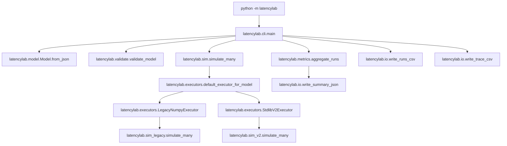

# LatencyLab Architecture

This document describes the *current* LatencyLab architecture as implemented in this repository.

Scope:

1. **Core simulator** under [`latencylab/`](latencylab/__init__.py:1): model parsing/validation, executor dispatch, simulation engines, metrics, and file outputs.
2. **Optional GUI** under [`latencylab_ui/`](latencylab_ui/__init__.py:1): Qt widgets + threaded run controller that consumes the core APIs.

The intent is to keep the core deterministic, stdlib-only, and testable; and keep the GUI as a thin shell over the core.

## Non-negotiable invariants (enforced by tests)

1. **Core must never import Qt**.
   - Enforced by a source scan in [`tests.test_ui_dependency_boundaries.test_no_qt_imports_in_core_latencylab_package()`](tests/test_ui_dependency_boundaries.py:10).
2. **Core must never depend on `latencylab_ui`**.
   - Enforced by [`tests.test_ui_dependency_boundaries.test_core_does_not_reference_latencylab_ui_package()`](tests/test_ui_dependency_boundaries.py:27).
3. **Simulation is deterministic for a given model + seed**.
   - Enforced by [`tests.test_determinism.test_simulation_is_deterministic_for_seed()`](tests/test_determinism.py:11).
4. **v1 execution is a frozen behavioral oracle** (legacy compatibility path).
   - Golden output snapshot is enforced by [`tests.test_determinism.test_v1_outputs_are_stable_golden_snapshot()`](tests/test_determinism.py:32).
5. **Delayed wiring (v2) must be visible and attributable**.
   - Enforced by [`tests.test_v2_delays.test_v2_delay_creates_synthetic_delay_nodes_in_trace_and_critical_path()`](tests/test_v2_delays.py:8).

## High-level component map

### Core package (`latencylab/`)

- **Entry points**
  - `python -m latencylab` -> [`latencylab.__main__`](latencylab/__main__.py:1) -> [`latencylab.cli.main()`](latencylab/cli.py:35)
- **Model**
  - JSON parsing -> [`latencylab.model.Model.from_json()`](latencylab/model.py:75)
  - Validation -> [`latencylab.validate.validate_model()`](latencylab/validate.py:10)
- **Simulation facade** (stdlib-only)
  - [`latencylab.sim.simulate_many()`](latencylab/sim.py:14)
- **Executor strategy boundary**
  - Protocol -> [`latencylab.executors.RunExecutor`](latencylab/executors.py:10)
  - Dispatch -> [`latencylab.executors.default_executor_for_model()`](latencylab/executors.py:67)
- **Execution engines**
  - Legacy v1 (NumPy-backed, frozen) -> [`latencylab.sim_legacy.simulate_many()`](latencylab/sim_legacy.py:75)
  - v2 stdlib engine (delayed wiring) -> [`latencylab.sim_v2.simulate_many()`](latencylab/sim_v2.py:37)
- **Metrics + outputs**
  - Aggregation -> [`latencylab.metrics.aggregate_runs()`](latencylab/metrics.py:37)
  - Task metadata injection (v2 only) -> [`latencylab.metrics.add_task_metadata()`](latencylab/metrics.py:70)
  - Writers -> [`latencylab.io.write_summary_json()`](latencylab/io.py:11), [`latencylab.io.write_runs_csv()`](latencylab/io.py:16), [`latencylab.io.write_trace_csv()`](latencylab/io.py:47)

### GUI package (`latencylab_ui/`)

- **Entry points**
  - `python -m latencylab_ui` -> [`latencylab_ui.__main__.main()`](latencylab_ui/__main__.py:6) -> [`latencylab_ui.app.run_app()`](latencylab_ui/app.py:12)
- **Main window and widgets**
  - Top-level window -> [`latencylab_ui.main_window.MainWindow`](latencylab_ui/main_window.py:52)
- **Threaded run lifecycle**
  - Controller -> [`latencylab_ui.run_controller.RunController`](latencylab_ui/run_controller.py:72)
  - Worker object -> [`latencylab_ui.run_controller.RunWorker`](latencylab_ui/run_controller.py:35)

## Overview diagrams

### CLI call flow and executor selection



### GUI threading model (worker emits signals to UI thread)

```mermaid
flowchart TD
  UIEntry[python -m latencylab_ui] --> App[latencylab_ui.app.run_app]
  App --> MW[latencylab_ui.main_window.MainWindow]

  MW -->|start(request)| RC[latencylab_ui.run_controller.RunController]
  RC -->|owns| QT[QThread]
  RC -->|moves| RW[latencylab_ui.run_controller.RunWorker]

  QT -->|started| RW
  RW -->|calls| CoreSim[latencylab.sim.simulate_many]
  RW -->|emits| SigOK[succeeded(run_token, outputs)]
  RW -->|emits| SigFail[failed(run_token, error_text)]
  RW -->|emits| SigDone[finished(run_token)]

  SigOK --> MW
  SigFail --> MW
  SigDone --> MW
```

### Dependency boundary (core is Qt-free; GUI consumes core)

```mermaid
flowchart LR
  subgraph Core[latencylab/ (stdlib-only)]
    M[model/validate] --> S[sim/executors]
    S --> E[sim_legacy or sim_v2]
    E --> Out[metrics/io]
  end

  subgraph UI[latencylab_ui/ (PySide6)]
    W[widgets] --> C[RunController/QThread]
    C --> R[render outputs]
  end

  UI -->|imports/calls| Core
  Core -. must NOT import .-> UI
```

## SOLID boundaries (what depends on what)

### Dependency inversion at the executor boundary

- The rest of the core calls the simulation facade [`latencylab.sim.simulate_many()`](latencylab/sim.py:14).
- The facade selects an execution strategy via [`latencylab.executors.default_executor_for_model()`](latencylab/executors.py:67).
- Executors implement [`latencylab.executors.RunExecutor`](latencylab/executors.py:10) and can be swapped without changing the model semantics.

This is the insertion point for future batch optimizations (including GPU / vectorized execution) without infecting the domain model.

### Single responsibility

- Parsing/types in [`latencylab.model.Model.from_json()`](latencylab/model.py:75) do not run simulation.
- Executors in [`latencylab.executors.default_executor_for_model()`](latencylab/executors.py:67) only choose and delegate.
- Engines in [`latencylab.sim_legacy.simulate_many()`](latencylab/sim_legacy.py:75) and [`latencylab.sim_v2.simulate_many()`](latencylab/sim_v2.py:37) implement run semantics.
- Metrics in [`latencylab.metrics.aggregate_runs()`](latencylab/metrics.py:37) do not influence scheduling.

### Open/closed

- New execution strategies are added by implementing [`latencylab.executors.RunExecutor`](latencylab/executors.py:10) and extending selection.
- Schema evolution is intended to be additive (new optional fields with defaults) to preserve old meaning.

## Model schema (what the simulator consumes)

### Versioning

- The schema version is stored on [`latencylab.model.Model.version`](latencylab/model.py:63).
- JSON version keys accepted by [`latencylab.model.Model.from_json()`](latencylab/model.py:75):
  - `schema_version` (preferred)
  - `version` (legacy alias)
  - `model_version` (legacy alias)
- Validation currently accepts **only** versions `{1, 2}` via [`latencylab.validate.validate_model()`](latencylab/validate.py:10).
- Executor dispatch is future-proofed for in-memory models with `version >= 2` via [`latencylab.executors.default_executor_for_model()`](latencylab/executors.py:67).

### Core entities

- Contexts: [`latencylab.model.ContextDef`](latencylab/model.py:7)
  - `concurrency` (>= 1)
  - `policy` is currently MVP-locked to `'fifo'` (validated in [`latencylab.validate.validate_model()`](latencylab/validate.py:10))
- Events: [`latencylab.model.EventDef`](latencylab/model.py:13)
  - Optional `tags`; `"ui"` is used to compute `first_ui_event_time_ms` / `last_ui_event_time_ms`.
- Tasks: [`latencylab.model.TaskDef`](latencylab/model.py:54)
  - `context`, `duration_ms`, `emit` (+ optional `meta` in v2)

### Duration distributions

Durations (and delay distributions) are represented by [`latencylab.model.DurationDist`](latencylab/model.py:21) and validated by [`latencylab.validate.validate_model()`](latencylab/validate.py:10).

Supported dists:

- `fixed`: `{ "dist": "fixed", "value": <>=0 }`
- `normal`: `{ "dist": "normal", "mean": <>, "std": <>=0, "min": <>=0? }`
- `lognormal`: `{ "dist": "lognormal", "mu": <>, "sigma": <>=0 }`

Note: there is **no** implemented "v1 lognormal.mean" migration/conversion in this codebase. Both engines sample lognormal via `mu/sigma` (see [`latencylab.sim_v2._sample_ms()`](latencylab/sim_v2.py:16) and [`latencylab.sim_legacy._sample_duration_ms()`](latencylab/sim_legacy.py:60)).

### Wiring and delayed wiring

The input JSON uses a single `wiring` object (event -> listeners). Parsing expands that into two forms:

- v1-compatible wiring (event -> task names) stored on [`latencylab.model.Model.wiring`](latencylab/model.py:63)
- v2 wiring edges (event -> edges w/ optional delays) stored on [`latencylab.model.Model.wiring_edges`](latencylab/model.py:63)

Edges are represented by [`latencylab.model.WiringEdge`](latencylab/model.py:48).

Listener forms accepted by [`latencylab.model.Model.from_json()`](latencylab/model.py:75):

- `"task_name"`
- `{ "task": "task_name" }`
- `{ "task": "task_name", "delay_ms": <number | dist> }`

If `delay_ms` is a number, it is parsed as `fixed` with that value (see parsing helper inside [`latencylab.model.Model.from_json()`](latencylab/model.py:118)).

## Simulation architecture

### Facade + executor dispatch

- Public entrypoint: [`latencylab.sim.simulate_many()`](latencylab/sim.py:14)
- Strategy selection: [`latencylab.executors.default_executor_for_model()`](latencylab/executors.py:67)
  - `version == 1` -> [`latencylab.executors.LegacyNumpyExecutor`](latencylab/executors.py:23)
  - `version >= 2` -> [`latencylab.executors.StdlibV2Executor`](latencylab/executors.py:45)

### v1 legacy engine (NumPy-backed, frozen oracle)

- Implementation: [`latencylab.sim_legacy`](latencylab/sim_legacy.py:1)
- Policy is explicitly documented as *FROZEN* in-module (see header comments in [`latencylab.sim_legacy`](latencylab/sim_legacy.py:1)).
- NumPy import is lazy and errors are made explicit by [`latencylab.sim_legacy._require_numpy()`](latencylab/sim_legacy.py:41).

### v2 stdlib engine (delayed wiring + synthetic delay tasks)

- Implementation: [`latencylab.sim_v2`](latencylab/sim_v2.py:1)
- Synthetic delays use a dedicated context constant [`latencylab.sim_v2.DELAY_CONTEXT`](latencylab/sim_v2.py:13) set to `"__delay__"`.

#### Delayed wiring semantics

When an event `e` occurs at time `t_emit`:

- For an edge with no delay: enqueue the target task at `t_emit`.
- For an edge with `delay_ms`: create a synthetic delay task instance named `delay(e->task)`:
  - start = `t_emit`
  - end = `t_emit + sampled_delay`
  - context = `__delay__` (not capacity constrained)
  - `parent_task_instance_id` is set to the emitting task instance id (if any)
  - on completion: enqueue the target task

This is implemented by [`latencylab.sim_v2.schedule_delay()`](latencylab/sim_v2.py:115) and verified by [`tests.test_v2_delays.test_v2_delay_creates_synthetic_delay_nodes_in_trace_and_critical_path()`](tests/test_v2_delays.py:8).

## Outputs and data contracts

### In-memory result types

- Per task-instance trace rows: [`latencylab.types.TaskInstance`](latencylab/types.py:6)
- Per-run results: [`latencylab.types.RunResult`](latencylab/types.py:22)

Important trace causality fields:

- `parent_task_instance_id`: event/delay causality ("who caused me to be enqueued")
- `capacity_parent_instance_id`: slot causality ("who last occupied the slot I ran on")

### File outputs

- `summary.json`: [`latencylab.io.write_summary_json()`](latencylab/io.py:11)
- `runs.csv`: [`latencylab.io.write_runs_csv()`](latencylab/io.py:16)
- `trace.csv` (optional): [`latencylab.io.write_trace_csv()`](latencylab/io.py:47)

### Metrics aggregation

- Aggregation is performed by [`latencylab.metrics.aggregate_runs()`](latencylab/metrics.py:37).
- Task metadata is injected into the summary **only for v2** by [`latencylab.metrics.add_task_metadata()`](latencylab/metrics.py:70).

#### Task metadata (measurement-only)

Tasks may include optional `meta` parsed by [`latencylab.model.TaskMeta.from_json()`](latencylab/model.py:34) into [`latencylab.model.TaskMeta`](latencylab/model.py:27) and stored on [`latencylab.model.TaskDef.meta`](latencylab/model.py:54).

Invariant: metadata must never affect scheduling; it is only surfaced in summary output.

## GUI architecture (how the UI consumes the core)

### Run lifecycle

- The user clicks Run in [`latencylab_ui.main_window.MainWindow`](latencylab_ui/main_window.py:52), which builds a [`latencylab_ui.run_controller.RunRequest`](latencylab_ui/run_controller.py:19) and calls [`latencylab_ui.run_controller.RunController.start()`](latencylab_ui/run_controller.py:108).
- The controller constructs a [`PySide6.QtCore.QThread`](latencylab_ui/run_controller.py:117) and moves a [`latencylab_ui.run_controller.RunWorker`](latencylab_ui/run_controller.py:35) onto it.
- The worker:
  - reads JSON -> [`latencylab.model.Model.from_json()`](latencylab/model.py:75)
  - validates -> [`latencylab.validate.validate_model()`](latencylab/validate.py:10)
  - simulates -> [`latencylab.sim.simulate_many()`](latencylab/sim.py:14)
  - aggregates -> [`latencylab.metrics.aggregate_runs()`](latencylab/metrics.py:37)
  - (v2) adds metadata -> [`latencylab.metrics.add_task_metadata()`](latencylab/metrics.py:70)
  - emits Qt signals back to the UI thread

### Cancellation semantics (v1)

Cancellation does **not** interrupt the core simulation. It marks the active token cancelled; completion results are discarded.

- Documented on [`latencylab_ui.run_controller.RunController`](latencylab_ui/run_controller.py:72)
- Enforced in UI handlers like [`latencylab_ui.main_window.MainWindow._on_run_succeeded()`](latencylab_ui/main_window.py:268)

### Shutdown semantics

On app shutdown, the controller waits for the worker thread to finish to avoid Qt warnings (see [`latencylab_ui.run_controller.RunController.shutdown()`](latencylab_ui/run_controller.py:143)).

## Dependency management and packaging

### Runtime dependencies

- Core engine: stdlib-only by design (see import surface around [`latencylab.sim.simulate_many()`](latencylab/sim.py:14)).
- GUI runtime: depends on PySide6 via [`requirements.txt`](requirements.txt:1).
- Legacy v1 execution: NumPy is optional and lazily imported by [`latencylab.sim_legacy._require_numpy()`](latencylab/sim_legacy.py:41).

### Packaging notes (current repository state)

- The packaged distribution is configured in [`pyproject.toml`](pyproject.toml:5).
- Only the `latencylab*` packages are included by setuptools find rules (see [`pyproject.toml`](pyproject.toml:40)); `latencylab_ui/` is not packaged.
- A console script is exposed for the CLI only via [`pyproject.toml`](pyproject.toml:15).

## Future extension points

### New executors (CPU/GPU/batch)

Add a new executor by implementing [`latencylab.executors.RunExecutor`](latencylab/executors.py:10) and selecting it inside [`latencylab.executors.default_executor_for_model()`](latencylab/executors.py:67).

Rules for new executors:

- Must preserve event-queue semantics (no domain branching on CPU/GPU).
- May optimize execution of many independent runs.
- May offer configuration to disable trace materialization for speed.

