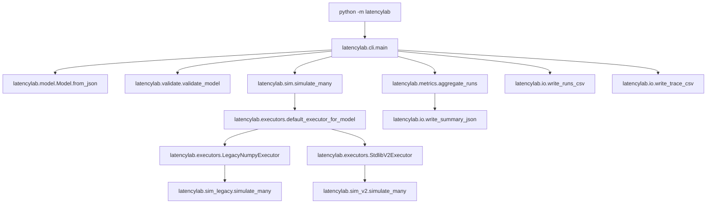
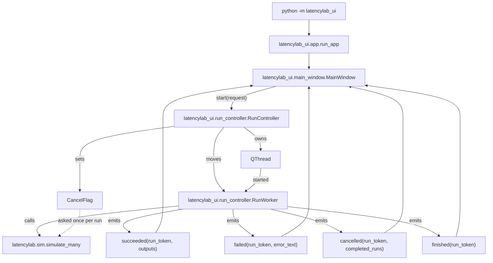
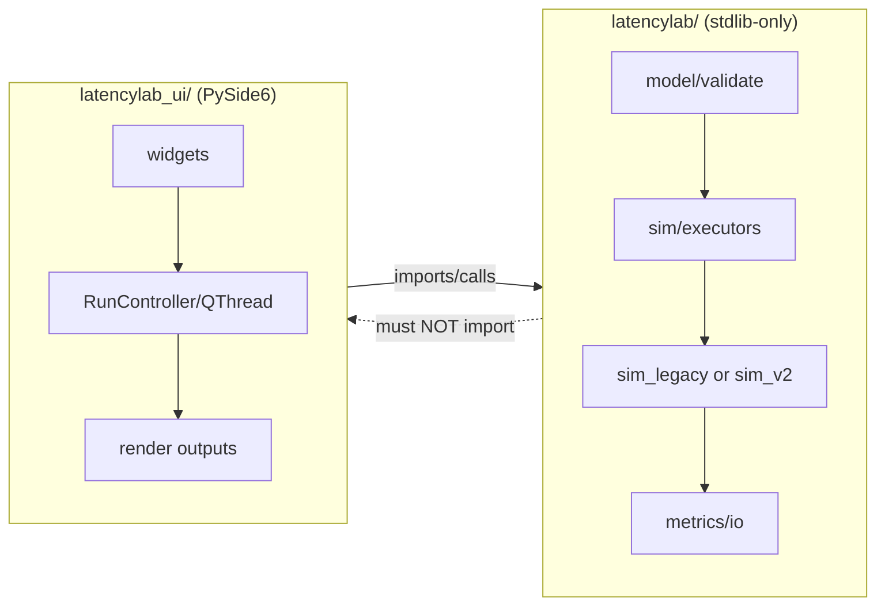

# LatencyLab Architecture

This document describes the *current* LatencyLab architecture as implemented in this repository.

Scope:

1. **Core simulator** under [`latencylab/`](latencylab/__init__.py:1): model parsing/validation, executor dispatch, simulation engines, metrics and file outputs.
2. **Optional GUI** under [`latencylab_ui/`](latencylab_ui/__init__.py:1): Qt widgets plus a threaded run controller that consumes the core APIs.
3. **Delivery** at the repository root and under [`installer/`](installer/app.py:1): the scripts that produce a Windows executable, a bespoke installer, a Flatpak and a macOS disk image.

The intent is to keep the core deterministic, stdlib-only and testable, while keeping the GUI a thin shell over the core.

## Non-negotiable invariants (enforced by tests)

1. **Core must never import Qt**.
   - Enforced by a source scan in [`tests.test_ui_dependency_boundaries.test_no_qt_imports_in_core_latencylab_package()`](tests/test_ui_dependency_boundaries.py:10).
2. **Core must never depend on `latencylab_ui`**.
   - Enforced by [`tests.test_ui_dependency_boundaries.test_core_does_not_reference_latencylab_ui_package()`](tests/test_ui_dependency_boundaries.py:27).
3. **Simulation is deterministic for a given model plus seed**.
   - Enforced by [`tests.test_determinism.test_simulation_is_deterministic_for_seed()`](tests/test_determinism.py:11).
4. **v1 execution is a frozen behavioural oracle** (legacy compatibility path).
   - Golden output snapshot is enforced by [`tests.test_determinism.test_v1_outputs_are_stable_golden_snapshot()`](tests/test_determinism.py:32).
5. **Delayed wiring (v2) must be visible and attributable**.
   - Enforced by [`tests.test_v2_delays.test_v2_delay_creates_synthetic_delay_nodes_in_trace_and_critical_path()`](tests/test_v2_delays.py:8).
6. **A cancelled run set is never aggregated.** Stopping early raises rather than returning fewer runs, because percentiles over a truncated set are indistinguishable from real ones.
   - The refusal lives in [`latencylab.cancellation.RunCancelled`](latencylab/cancellation.py:29) and is covered by [`tests/test_cancellation.py`](tests/test_cancellation.py:1).
7. **Every shipped example validates.** The examples are discovered from disk rather than named, so adding one to `examples/` opts it into the check automatically.
   - Enforced by [`tests/test_examples.py`](tests/test_examples.py:1).
8. **One version string exists in the repository**, the root `VERSION` file.
   - Enforced by [`tests/test_version_single_source.py`](tests/test_version_single_source.py:1).

## High-level component map

### Core package (`latencylab/`)

- **Entry points**
  - `python -m latencylab` -> [`latencylab.__main__`](latencylab/__main__.py:1) -> [`latencylab.cli.main()`](latencylab/cli.py:35)
- **Model**
  - JSON parsing -> [`latencylab.model.Model.from_json()`](latencylab/model.py:75)
  - Validation -> [`latencylab.validate.validate_model()`](latencylab/validate.py:10)
- **Simulation facade** (stdlib-only)
  - [`latencylab.sim.simulate_many()`](latencylab/sim.py:15)
- **Executor strategy boundary**
  - Protocol -> [`latencylab.executors.RunExecutor`](latencylab/executors.py:11)
  - Dispatch -> [`latencylab.executors.default_executor_for_model()`](latencylab/executors.py:73)
- **Execution engines**
  - Legacy v1 (NumPy-backed, frozen) -> [`latencylab.sim_legacy.simulate_many()`](latencylab/sim_legacy.py:80)
  - v2 stdlib engine (delayed wiring) -> [`latencylab.sim_v2.simulate_many()`](latencylab/sim_v2.py:42)
- **Cancellation** (Qt-free)
  - Protocol plus refusal -> [`latencylab.cancellation`](latencylab/cancellation.py:1)
- **Metrics and outputs**
  - Aggregation -> [`latencylab.metrics.aggregate_runs()`](latencylab/metrics.py:37)
  - Task metadata injection (v2 only) -> [`latencylab.metrics.add_task_metadata()`](latencylab/metrics.py:70)
  - Writers -> [`latencylab.io.write_summary_json()`](latencylab/io.py:11), [`latencylab.io.write_runs_csv()`](latencylab/io.py:16), [`latencylab.io.write_trace_csv()`](latencylab/io.py:47)

### GUI package (`latencylab_ui/`)

- **Entry points**
  - `python -m latencylab_ui` -> [`latencylab_ui.__main__.main()`](latencylab_ui/__main__.py:6) -> [`latencylab_ui.app.run_app()`](latencylab_ui/app.py:14)
  - `python runner.py` is a repo-root shim onto the same entry point, and is what the frozen build starts at.
- **Main window and widgets**
  - Top-level window -> [`latencylab_ui.main_window.MainWindow`](latencylab_ui/main_window.py:46)
- **Threaded run lifecycle**
  - Controller -> [`latencylab_ui.run_controller.RunController`](latencylab_ui/run_controller.py:103)
  - Worker object -> [`latencylab_ui.run_controller.RunWorker`](latencylab_ui/run_controller.py:55)

#### GUI internal modules (maintainability)

The GUI code is intentionally split into smaller modules to keep individual files small and readable.

- Main window composition and behaviour:
  - Window class -> [`latencylab_ui.main_window.MainWindow`](latencylab_ui/main_window.py:46)
  - Panel policies (opening the composer, toggling Distributions) ->
    [`latencylab_ui.main_window_dock_switching`](latencylab_ui/main_window_dock_switching.py:1)
  - File IO (open model / export last outputs) ->
    [`latencylab_ui.main_window_file_io.export_runs()`](latencylab_ui/main_window_file_io.py:28)
  - Top bar construction and deterministic button sizing ->
    [`latencylab_ui.main_window_top_bar.build_top_bar()`](latencylab_ui/main_window_top_bar.py:89)
  - Menu wiring -> [`latencylab_ui.main_window_menus`](latencylab_ui/main_window_menus.py:1)
  - Where a file dialog opens -> [`latencylab_ui.user_paths`](latencylab_ui/user_paths.py:1)

- Theme and style hardening:
  - Semantic colour tokens, one set per theme -> [`latencylab_ui.theme_tokens`](latencylab_ui/theme_tokens.py:1)
  - Apply theme (palette plus generated stylesheet) ->
    [`latencylab_ui.theme.apply_theme()`](latencylab_ui/theme.py:79)
  - One stylesheet template, built from the tokens -> [`latencylab_ui.theme_stylesheet`](latencylab_ui/theme_stylesheet.py:1)
  - Light/dark switch -> [`latencylab_ui.theme_toggle`](latencylab_ui/theme_toggle.py:1)
  - QComboBox popup hardening (palette plus per-item roles, reasserted on popup show) ->
    [`latencylab_ui.qt_style_helpers.harden_combobox_popup()`](latencylab_ui/qt_style_helpers.py:163)
  - Table height, row heights and column widths derived from the contents ->
    [`latencylab_ui.qt_style_helpers.size_table_to_rows()`](latencylab_ui/qt_style_helpers.py:276)

- Keyboard navigation (one explicit focus ring, not natural Tab order):
  - Traversal controller and ring order -> [`latencylab_ui.focus_cycle`](latencylab_ui/focus_cycle.py:1)
  - Per-event key rules -> [`latencylab_ui.focus_cycle_keys`](latencylab_ui/focus_cycle_keys.py:1)
  - Menu-bar behaviour the toolkit does not provide -> [`latencylab_ui.focus_cycle_menu`](latencylab_ui/focus_cycle_menu.py:1)
  - Widget collection in layout order, including docks -> [`latencylab_ui.focus_cycle_widgets`](latencylab_ui/focus_cycle_widgets.py:1)

- Dialogs:
  - Base that opens on its first usable control -> [`latencylab_ui.first_stop_dialog`](latencylab_ui/first_stop_dialog.py:1)
  - About, and the credits it renders -> [`latencylab_ui.about_dialog`](latencylab_ui/about_dialog.py:1), [`latencylab_ui.about_text`](latencylab_ui/about_text.py:1)
  - Licence viewers -> [`latencylab_ui.main_licence_dialog`](latencylab_ui/main_licence_dialog.py:1), [`latencylab_ui.licence_dialog`](latencylab_ui/licence_dialog.py:1)
  - How to read the outputs -> [`latencylab_ui.how_to_read_dialog`](latencylab_ui/how_to_read_dialog.py:1)
  - Long text that reads itself -> [`latencylab_ui.auto_scroller`](latencylab_ui/auto_scroller.py:1)

- Distributions (inspection, no resimulation):
  - Dock -> [`latencylab_ui.distributions_dock`](latencylab_ui/distributions_dock.py:1)
  - Qt-free aggregation -> [`latencylab_ui.distributions_agg`](latencylab_ui/distributions_agg.py:1)
  - Critical-path frequency chart -> [`latencylab_ui.critical_path_frequency_widget`](latencylab_ui/critical_path_frequency_widget.py:1)

- Model Composer (authoring UI, a modal two-pane dialog):
  - Dialog and model state -> [`latencylab_ui.model_composer_dialog.ModelComposerDialog`](latencylab_ui/model_composer_dialog.py:59)
  - Left pane, what the model is made of -> [`latencylab_ui.model_composer_tree.ComposerTree`](latencylab_ui/model_composer_tree.py:47)
  - Pane assembly and dialog sizing -> [`latencylab_ui.model_composer_panes`](latencylab_ui/model_composer_panes.py:1)
  - Editors:
    - System -> [`latencylab_ui.model_composer_system_editor.SystemEditor`](latencylab_ui/model_composer_system_editor.py:9)
    - Contexts -> [`latencylab_ui.model_composer_contexts_editor.ContextsEditor`](latencylab_ui/model_composer_contexts_editor.py:22)
    - Tasks -> [`latencylab_ui.model_composer_tasks_editor.TasksEditor`](latencylab_ui/model_composer_tasks_editor.py:127)
    - Wiring -> [`latencylab_ui.model_composer_wiring_editor.WiringEditor`](latencylab_ui/model_composer_wiring_editor.py:30)

- Bundled-data lookup (one search, two callers):
  - The search itself -> [`latencylab_ui.packaged_dir`](latencylab_ui/packaged_dir.py:1)
  - Icons -> [`latencylab_ui.icon_resolver`](latencylab_ui/icon_resolver.py:1)
  - Example models, and the labels the menu shows -> [`latencylab_ui.example_models`](latencylab_ui/example_models.py:1)

## Overview diagrams

### CLI call flow and executor selection

```mermaid
flowchart TD
  CLIEntry[python -m latencylab] --> CLI[latencylab.cli.main]
  CLI --> Parse[latencylab.model.Model.from_json]
  CLI --> Validate[latencylab.validate.validate_model]
  CLI --> Sim[latencylab.sim.simulate_many]
  Sim --> Pick[latencylab.executors.default_executor_for_model]
  Pick --> Legacy[latencylab.executors.LegacyNumpyExecutor]
  Pick --> V2[latencylab.executors.StdlibV2Executor]
  Legacy --> LSim[latencylab.sim_legacy.simulate_many]
  V2 --> V2Sim[latencylab.sim_v2.simulate_many]
  CLI --> Metrics[latencylab.metrics.aggregate_runs]
  Metrics --> Summary[latencylab.io.write_summary_json]
  CLI --> Runs[latencylab.io.write_runs_csv]
  CLI --> Trace[latencylab.io.write_trace_csv]
```

### GUI threading model (worker emits signals to UI thread)

```mermaid
flowchart TD
  UIEntry[python -m latencylab_ui] --> App[latencylab_ui.app.run_app]
  App --> MW[latencylab_ui.main_window.MainWindow]

  MW -->|"start(request)"| RC[latencylab_ui.run_controller.RunController]
  RC -->|owns| QT[QThread]
  RC -->|moves| RW[latencylab_ui.run_controller.RunWorker]
  RC -->|"sets"| CF[CancelFlag]

  QT -->|started| RW
  RW -->|calls| CoreSim[latencylab.sim.simulate_many]
  CF -.->|"asked once per run"| CoreSim
  RW -->|emits| SigOK["succeeded(run_token, outputs)"]
  RW -->|emits| SigFail["failed(run_token, error_text)"]
  RW -->|emits| SigCancel["cancelled(run_token, completed_runs)"]
  RW -->|emits| SigDone["finished(run_token)"]

  SigOK --> MW
  SigFail --> MW
  SigCancel --> MW
  SigDone --> MW
```

### Dependency boundary (core is Qt-free; GUI consumes core)

```mermaid
flowchart LR
  subgraph Core["latencylab/ (stdlib-only)"]
    M[model/validate] --> S[sim/executors]
    S --> E[sim_legacy or sim_v2]
    E --> Out[metrics/io]
  end

  subgraph UI["latencylab_ui/ (PySide6)"]
    W[widgets] --> C[RunController/QThread]
    C --> R[render outputs]
  end

  UI -->|imports/calls| Core
  Core -. must NOT import .-> UI
```

## SOLID boundaries (what depends on what)

### Dependency inversion at the executor boundary

- The rest of the core calls the simulation facade [`latencylab.sim.simulate_many()`](latencylab/sim.py:15).
- The facade selects an execution strategy via [`latencylab.executors.default_executor_for_model()`](latencylab/executors.py:73).
- Executors implement [`latencylab.executors.RunExecutor`](latencylab/executors.py:11) and can be swapped without changing the model semantics.

This is the insertion point for future batch optimisations (including GPU or vectorised execution) without infecting the domain model.

### Dependency inversion at the cancellation boundary

The core is asked to stop through a Protocol it defines and never looks behind: [`latencylab.cancellation.CancellationSignal`](latencylab/cancellation.py:22) has one method, `is_cancelled()`. The GUI passes a Qt-thread-safe flag; a test passes a counter. Neither is visible to the simulator, which is what keeps the stop path out of the Qt-free boundary.

### Single responsibility

- Parsing/types in [`latencylab.model.Model.from_json()`](latencylab/model.py:75) do not run simulation.
- Executors in [`latencylab.executors.default_executor_for_model()`](latencylab/executors.py:73) only choose and delegate.
- Engines in [`latencylab.sim_legacy.simulate_many()`](latencylab/sim_legacy.py:80) and [`latencylab.sim_v2.simulate_many()`](latencylab/sim_v2.py:42) implement run semantics.
- Metrics in [`latencylab.metrics.aggregate_runs()`](latencylab/metrics.py:37) do not influence scheduling.

### Open/closed

- New execution strategies are added by implementing [`latencylab.executors.RunExecutor`](latencylab/executors.py:11) and extending selection.
- Schema evolution is intended to be additive (new optional fields with defaults) to preserve old meaning.

## Model schema (what the simulator consumes)

### Versioning

- The schema version is stored on [`latencylab.model.Model.version`](latencylab/model.py:63).
- JSON version keys accepted by [`latencylab.model.Model.from_json()`](latencylab/model.py:75):
  - `schema_version` (preferred)
  - `version` (legacy alias)
  - `model_version` (legacy alias)
- Validation currently accepts **only** versions `{1, 2}` via [`latencylab.validate.validate_model()`](latencylab/validate.py:10).
- Executor dispatch is future-proofed for in-memory models with `version >= 2` via [`latencylab.executors.default_executor_for_model()`](latencylab/executors.py:73).

### Core entities

- Contexts: [`latencylab.model.ContextDef`](latencylab/model.py:7)
  - `concurrency` (>= 1)
  - `policy` is currently MVP-locked to `'fifo'` (validated in [`latencylab.validate.validate_model()`](latencylab/validate.py:10))
- Events: [`latencylab.model.EventDef`](latencylab/model.py:13)
  - Optional `tags`; `"ui"` is used to compute `first_ui_event_time_ms` / `last_ui_event_time_ms`.
- Tasks: [`latencylab.model.TaskDef`](latencylab/model.py:54)
  - `context`, `duration_ms`, `emit` (plus optional `meta` in v2)

### Duration distributions

Durations (and delay distributions) are represented by [`latencylab.model.DurationDist`](latencylab/model.py:21) and validated by [`latencylab.validate.validate_model()`](latencylab/validate.py:10).

Supported dists:

- `fixed`: `{ "dist": "fixed", "value": <>=0 }`
- `normal`: `{ "dist": "normal", "mean": <>, "std": <>=0, "min": <>=0? }`
- `lognormal`: `{ "dist": "lognormal", "mu": <>, "sigma": <>=0 }`

Note: there is **no** implemented "v1 lognormal.mean" migration/conversion in this codebase. Both engines sample lognormal via `mu/sigma` (see [`latencylab.sim_v2._sample_ms()`](latencylab/sim_v2.py:21) and [`latencylab.sim_legacy._sample_duration_ms()`](latencylab/sim_legacy.py:65)).

### Wiring and delayed wiring

The input JSON uses a single `wiring` object (event -> listeners). Parsing expands that into two forms:

- v1-compatible wiring (event -> task names) stored on [`latencylab.model.Model.wiring`](latencylab/model.py:63)
- v2 wiring edges (event -> edges with optional delays) stored on [`latencylab.model.Model.wiring_edges`](latencylab/model.py:63)

Edges are represented by [`latencylab.model.WiringEdge`](latencylab/model.py:48).

Listener forms accepted by [`latencylab.model.Model.from_json()`](latencylab/model.py:75):

- `"task_name"`
- `{ "task": "task_name" }`
- `{ "task": "task_name", "delay_ms": <number | dist> }`

If `delay_ms` is a number, it is parsed as `fixed` with that value (see parsing helper inside [`latencylab.model.Model.from_json()`](latencylab/model.py:118)).

### Worked examples

`examples/` holds the models the tests validate, the documentation points at and
the application opens from its own **Examples** menu. The set is discovered from
disk in all three places rather than listed, so adding a model to that directory
opts it into the validation test and puts it on the menu, with no second place to
update:

- Validation: [`tests/test_examples.py`](tests/test_examples.py:1) walks the directory.
- Menu: [`latencylab_ui.example_models.list_examples()`](latencylab_ui/example_models.py:1) walks the same directory, wherever the packaging put it, and derives each label from the file name. A caption per file would read better and would be a mapping keyed on file names, which is the drift this avoids.
- Packaging: all three delivery paths stage `examples/` beside the application, so a fresh install has something to open before the user has a model of their own.

| Example | What it shows |
|---|---|
| `interactive.json` | The smallest useful v1 model: one click, one background fetch, one render. |
| `contention.json` | A context with a concurrency limit, so queue wait becomes visible. |
| `checkout.json` | A v2 storefront checkout: four parallel branches, a serialised database context and a fixed debounce delay that turns out to own the median. It is also the worked example of delayed wiring. |

## Simulation architecture

### Facade plus executor dispatch

- Public entrypoint: [`latencylab.sim.simulate_many()`](latencylab/sim.py:15)
- Strategy selection: [`latencylab.executors.default_executor_for_model()`](latencylab/executors.py:73)
  - `version == 1` -> [`latencylab.executors.LegacyNumpyExecutor`](latencylab/executors.py:26)
  - `version >= 2` -> [`latencylab.executors.StdlibV2Executor`](latencylab/executors.py:50)

### v1 legacy engine (NumPy-backed, frozen oracle)

- Implementation: [`latencylab.sim_legacy`](latencylab/sim_legacy.py:1)
- Policy is explicitly documented as *FROZEN* in-module (see header comments in [`latencylab.sim_legacy`](latencylab/sim_legacy.py:1)).
- NumPy import is lazy and errors are made explicit by [`latencylab.sim_legacy._require_numpy()`](latencylab/sim_legacy.py:46).

### v2 stdlib engine (delayed wiring plus synthetic delay tasks)

- Implementation: [`latencylab.sim_v2`](latencylab/sim_v2.py:1)
- Synthetic delays use a dedicated context constant [`latencylab.sim_v2.DELAY_CONTEXT`](latencylab/sim_v2.py:18) set to `"__delay__"`.

#### Delayed wiring semantics

When an event `e` occurs at time `t_emit`:

- For an edge with no delay: enqueue the target task at `t_emit`.
- For an edge with `delay_ms`: create a synthetic delay task instance named `delay(e->task)`:
  - start = `t_emit`
  - end = `t_emit + sampled_delay`
  - context = `__delay__` (not capacity constrained)
  - `parent_task_instance_id` is set to the emitting task instance id (if any)
  - on completion: enqueue the target task

This is implemented by [`latencylab.sim_v2.schedule_delay()`](latencylab/sim_v2.py:123) and verified by [`tests.test_v2_delays.test_v2_delay_creates_synthetic_delay_nodes_in_trace_and_critical_path()`](tests/test_v2_delays.py:8).

A delay is a first-class node precisely so it can be blamed. In `examples/checkout.json` a 150ms debounce on one branch is the critical path in most runs, which is the kind of finding the tool exists to surface.

### Cancellation semantics

Cancellation genuinely stops the work. The simulator is CPU-bound and cannot be interrupted safely from outside, so it is **asked** to stop, at the boundary between one run and the next:

- The question is a Protocol, [`latencylab.cancellation.CancellationSignal`](latencylab/cancellation.py:22), so the core never learns what is answering it.
- The check is once per RUN rather than once per event. Each run seeds its own generator from the run index, so stopping between runs cannot leave a run half simulated, and the cost is one predicate per run rather than one per event.
- The worst-case delay before a stop takes effect is therefore one run, which is a number the user can be told.
- Stopping raises [`latencylab.cancellation.RunCancelled`](latencylab/cancellation.py:29) carrying the completed-run count. It does **not** return a shorter result set: aggregating half the runs would produce percentiles that look exactly like real ones while describing a system nobody asked about.
- The GUI surfaces this as [`latencylab_ui.run_controller.RunController.cancelled`](latencylab_ui/run_controller.py:115), which reports how many runs completed before the stop.

### Shutdown semantics

On app shutdown, the controller waits for the worker thread to finish to avoid Qt warnings (see [`latencylab_ui.run_controller.RunController.shutdown()`](latencylab_ui/run_controller.py:185)).

## Outputs and data contracts

### In-memory result types

- Per task-instance trace rows: [`latencylab.types.TaskInstance`](latencylab/types.py:6)
- Per-run results: [`latencylab.types.RunResult`](latencylab/types.py:22)

Important trace causality fields:

- `parent_task_instance_id`: event/delay causality ("who caused me to be enqueued")
- `capacity_parent_instance_id`: slot causality ("who last occupied the slot I ran on")

### File outputs

- `summary.json`: [`latencylab.io.write_summary_json()`](latencylab/io.py:11)
- `runs.csv`: [`latencylab.io.write_runs_csv()`](latencylab/io.py:16)
- `trace.csv` (optional): [`latencylab.io.write_trace_csv()`](latencylab/io.py:47)

### Metrics aggregation

- Aggregation is performed by [`latencylab.metrics.aggregate_runs()`](latencylab/metrics.py:37).
- Task metadata is injected into the summary **only for v2** by [`latencylab.metrics.add_task_metadata()`](latencylab/metrics.py:70).

#### Task metadata (measurement-only)

Tasks may include optional `meta` parsed by [`latencylab.model.TaskMeta.from_json()`](latencylab/model.py:34) into [`latencylab.model.TaskMeta`](latencylab/model.py:27) and stored on [`latencylab.model.TaskDef.meta`](latencylab/model.py:54).

Invariant: metadata must never affect scheduling; it is only surfaced in summary output.

## GUI architecture (how the UI consumes the core)

### Run lifecycle

- The user clicks Run in [`latencylab_ui.main_window.MainWindow`](latencylab_ui/main_window.py:46), which builds a [`latencylab_ui.run_controller.RunRequest`](latencylab_ui/run_controller.py:22) and calls [`latencylab_ui.run_controller.RunController.start()`](latencylab_ui/run_controller.py:142).
- The controller constructs a [`PySide6.QtCore.QThread`](latencylab_ui/run_controller.py:152) and moves a [`latencylab_ui.run_controller.RunWorker`](latencylab_ui/run_controller.py:55) onto it, together with the cancel flag the core will be asked about.
- The worker:
  - reads JSON -> [`latencylab.model.Model.from_json()`](latencylab/model.py:75)
  - validates -> [`latencylab.validate.validate_model()`](latencylab/validate.py:10)
  - simulates -> [`latencylab.sim.simulate_many()`](latencylab/sim.py:15)
  - aggregates -> [`latencylab.metrics.aggregate_runs()`](latencylab/metrics.py:37)
  - (v2) adds metadata -> [`latencylab.metrics.add_task_metadata()`](latencylab/metrics.py:70)
  - emits Qt signals back to the UI thread

`succeeded` arrives BEFORE `finished`, so the controller is still running when the first is handled. Anything that depends on "the run is over" belongs on `finished`.

### Keyboard navigation

Full keyboard reachability is built as one explicit focus ring rather than left to natural Tab traversal.

- `Tab` and `Right` step forward, `Shift+Tab` and `Left` step back, and the ring wraps at both ends. The horizontal arrows are tested first, so they step the ring everywhere rather than being swallowed by the menu bar or a list.
- Ring order is the menu titles, then the body widget stops, then the docks. Docks are siblings of `centralWidget()`, so they are collected explicitly by [`latencylab_ui.focus_cycle_widgets.collect_interactive_widgets_in_layout_order()`](latencylab_ui/focus_cycle_widgets.py:1). The Model Composer used to depend on that and no longer does: it is a dialog, which is a window of its own and owns its focus, so it is reached the way every other dialog is rather than by the main ring being taught to walk into it.
- A disabled or hidden control is skipped by the ring and shows no ring colour, because every hover and focus rule is gated on `:enabled`.
- The main window starts neutral: nothing is focused and no menu is open until the first `Tab` or `Right`. Dialogs do the opposite and open already focused on their first usable control ([`latencylab_ui.first_stop_dialog`](latencylab_ui/first_stop_dialog.py:1)), because a dialog was opened on purpose.
- **Examples is a top-level menu rather than a submenu of File, and the ring is the reason.** The ring claims Left and Right to step between stops, which is the same pair Qt uses to open and close a submenu, so a submenu would be the one part of the menu bar the keyboard could not reach the usual way. A title of its own costs nothing and is walked like any other.
- Menus are built by [`latencylab_ui.main_window_menus.add_menu()`](latencylab_ui/main_window_menus.py:1) with an explicit parent rather than by `menuBar().addMenu(title)`. The two look equivalent and are not: a menu built the second way is destroyed when the Python wrapper of its QAction is collected, leaving the bar holding a deleted object, and the ring rebuilds exactly that wrapper list on every keystroke.

### Theme model

One stylesheet template is generated from one token set per theme ([`latencylab_ui.theme_tokens`](latencylab_ui/theme_tokens.py:1)), so the three-state ring model holds in every theme by construction: no ring at rest, a green ring while enabled and hovered or focused, a permanent red ring while disabled. `accent` carries data meaning and never draws a ring.

The accent is banana yellow and is one value across both themes, like `primary`,
because a filled block does not need the per-theme adjustment a line drawn on a
surface does. Anything painted ON it takes `accent_text`, a near-black: the
accent is far too light to carry the near-white every other filled control uses.
That applies to drawn icons as well as to text, and a stylesheet cannot reach
inside an icon, so a checkable button whose checked fill is the accent supplies
a second rendering of its glyph in the accent's ink. Without it the glyph stays
near-white and disappears at exactly the moment the button means something. A
button carrying the application's MARK rather than a drawn glyph is the
exception: a picture cannot be recoloured that way, so its checked state is said
by the fill and the ink alone.

**One place decides how tall an input stands.** A Qt type selector matches a
class and its subclasses, and `QDoubleSpinBox` is a SIBLING of `QSpinBox` rather
than a subclass, so an input rule written for the one never reached the other.
`QLineEdit` was not named at all. Measured in the composer with a model loaded,
three controls doing the same job stood at 51px, 19px and 22px. The rule now
names [`QAbstractSpinBox` and `QLineEdit`](latencylab_ui/theme_stylesheet.py:140),
which reaches every kind, and resets the `QLineEdit` those controls CONTAIN, or
the inner field would carry the outer control's border, padding and minimum on
top of the outer's own.

The second half of that rule is that nothing may quietly overrule it. An
explicit `setMinimumHeight` on a widget is a floor a layout may squeeze down to,
so a combo the sheet sized at 48px could still be handed 26px and drawn clipped;
and the composer's scrolling body was set to `Maximum` vertically, which reads
as "no taller than it needs" and means "may be made shorter than it needs",
leaving nineteen controls under their own minimum. Both are gone.
[`tests/test_ui_input_metrics.py`](tests/test_ui_input_metrics.py:1) asserts the
invariant rather than today's numbers: no input is drawn smaller than it asks
for, in either theme. It measures the SETTLED state, since Qt defers layout and
the offscreen platform does not propagate size hints, so geometry read straight
after building a panel is whatever it was before the layout ran.

**Scrolling past a control must not change it.** Qt gives the wheel to whatever
sits under the pointer, and a combo box or spin box accepts it unfocused, so
reading down the Model Composer used to walk through every concurrency and every
distribution on the way past, silently rewriting the model.
[`latencylab_ui.wheel_guard`](latencylab_ui/wheel_guard.py:1) denies the wheel to
an unfocused control and forwards it to the enclosing scroll area, so the panel
still scrolls rather than leaving a dead patch under the pointer. It is installed
once on the application, not per control, because the composer creates and
destroys cards as the model is edited.

Denying the wheel is not on its own enough, and two further facts are what make
the rule above true rather than merely stated. Qt gives these controls
`WheelFocus` by default, which means the wheel FOCUSES them before it reaches
them, so travelling over one both took the keyboard focus and left the control
focused, which is exactly the case the guard hands its wheel back to: values
changing and focus getting stuck were one fault seen from either end.
[`deny_wheel_focus()`](latencylab_ui/wheel_guard.py:81) narrows the policy on
`Polish`, which an application filter sees for controls built long after it was
installed. And the forwarded event has to skip an ancestor that cannot move: a
spin box in a table sits inside the TABLE's scroll area, so the nearest ancestor
absorbed the wheel and the panel being read never shifted.
[`enclosing_scroll_area()`](latencylab_ui/wheel_guard.py:108) walks on to the
first ancestor that can consume it on the axis the wheel was turned.

**A table is as tall as what it holds, and a row is as tall as what stands in
it.** Three constants that had never looked at the contents were stacked on top
of each other here. Qt's size hint for a scroll area is fixed, and its minimum
allows a squeeze to roughly two rows, so the Contexts table reserved the same
height whether it held two contexts or twenty and collapsed when the panel was short. Its default column width is fixed, so a long name was clipped inside its
cell while the room it needed sat empty in the same row and nothing scrolled,
because the columns together were narrower than the viewport. And its default
row height is fixed at less than the themed inputs ask for: a spin box wanting
51px was drawn into a 30px row, so its lower half including the DOWN button fell
outside the row and was never painted, and its number sat against the bottom of
what remained and read as badly aligned. That last one is one fault reported as
two, the same way the wheel and the focus were.

[`size_table_to_rows()`](latencylab_ui/qt_style_helpers.py:276) fixes the height
to the rows present, capped at `MAX_VISIBLE_TABLE_ROWS` so a large model cannot
push the rest of the panel out of reach;
[`stretch_table_columns()`](latencylab_ui/qt_style_helpers.py:224) gives the name
column the slack; and
[`fit_rows_to_contents()`](latencylab_ui/qt_style_helpers.py:244) lets a row be
as tall as the tallest thing in it, so the control metrics decide the row rather
than the row silently cropping the control.

The height is measured with
[`_settled_row_height()`](latencylab_ui/qt_style_helpers.py:259) rather than
`rowHeight()`, because a header on `ResizeToContents` recalculates lazily and the
old value is still being reported at the moment a row is filled. Measuring is
also deliberately called at the END of each mutator rather than bound to the
model's row signals: those fire while the row exists but is still empty, which
is the same class of mistake, a fact read before it is true.

One scrolling surface is the point throughout: a nested scrollbar inside a panel
that is itself scrolling is what silently absorbed the wheel meant for the outer.

**Anything that floats gets its own surface.** Menus, tooltips and combo popups are painted on `elevated`, outlined in `elevated_border` and highlight on `elevated_hover`. Without those the toolkit paints a popup in the window colour with no border, which is not a subtle contrast problem: measured in the dark theme, a dropped menu sat at zero luminance difference from the window behind it and its items read as text lying on the page. The rule is asserted against rendered pixels in [`tests/test_ui_menu_contrast.py`](tests/test_ui_menu_contrast.py:1), not against the stylesheet source.

A combo popup cannot be styled the same way, because its colours are palette-driven on purpose (a CSS background on the popup view reintroduces the invisible-text bug that [`latencylab_ui.qt_style_helpers`](latencylab_ui/qt_style_helpers.py:1) exists to prevent). It reads `elevated` back out of the palette instead, where it rides on the `ToolTipBase` role: Qt has no "popup background" role, and the colour has to be read at the moment the popup opens rather than captured when it was built, or switching theme leaves the popup painted in the old one.

### The composer names its parts rather than stacking them

The composer was a dock down the right-hand side: one column, every section in
it at once, scrolling. Measured with `examples/checkout.json` loaded, that
column asked for **4,822px** of height in a viewport of about 880, the tasks
alone accounting for 3,647 of it because each card is around 350px and there
were eleven. Everything past the second task was found by scrolling and then
remembering where it was.

A model is not a document. It is a handful of named things, so
[`ComposerTree`](latencylab_ui/model_composer_tree.py:47) lists them on the left
and the right pane shows the one that is selected. The sections are fixed,
because they are the parts a model HAS rather than anything the user creates;
only Tasks has children, because tasks are the only part there can be many of
and the only part that was long. Measured the same way afterwards, every section
fits without scrolling at all: System 220px, Contexts 328, Wiring 368, one task
453, against a 753px pane.

Two details are load-bearing. The tree is relabelled rather than rebuilt when
the task COUNT is unchanged, because a name is edited a keystroke at a time and
every keystroke says the model changed: rebuilding on each one would take the
selection and the keyboard away from the field being typed into. And the task
rows come from `card_labels()` rather than `task_names()`, which drops the
unnamed: right for a model, wrong for a list someone selects from, because the
row positions would stop matching the cards the moment a task was half-typed.

It is a dialog rather than a dock, and modal, because composing is something you
go and do rather than keep half an eye on. That removed a policy rather than
moving one: the composer and Distributions used to share the right-hand area, so
opening either was a question about the other. Opening the composer is now
[`open_model_composer()`](latencylab_ui/main_window_dock_switching.py:10), which
asks nothing about layout. It is `show()` rather than `exec()`: both are modal,
because the dialog says it is, and the difference is that `exec` also starts a
nested event loop and does not return until the dialog closes, which turns
opening a panel into a call that never comes back.

The export prompt survived the change, because it was never about layout: it
asks whether to keep results that are about to stop being the thing on screen.
The compose button's checked state did not, because it existed to say which of
two panels had the right-hand area, and a modal dialog IS the window while it is
open.

### Composing and editing are one surface

The composer could build a model and export it, and nothing could put one back
in, so a model that had just been opened could not be edited. Editing is the
same four editors driven from the other end:
[`latencylab_ui.model_composer_load.load_raw_model()`](latencylab_ui/model_composer_load.py:1)
fills them from a parsed model, and the order is load-bearing. Contexts go in
first because a task card can only select a context the contexts table already
knows about; the schema version goes in before the tasks because it decides
whether a card shows its category field; wiring goes last, once the task and
event names it offers are real.

Reading a model back in is wider than writing one out. The file format accepts
three spellings of the version key and three spellings of a wiring listener, so
[`model_composer_types.read_schema_version()`](latencylab_ui/model_composer_types.py:1)
and `wiring_edges_from_raw()` widen every one of them: a model the engine will
run must be a model the editor will open, or a valid file becomes uneditable
for a reason the user cannot see.

An open editor follows the model that is opened next
([`latencylab_ui.main_window_editing.refresh_open_editor()`](latencylab_ui/main_window_editing.py:1)),
because an editor showing a model is a view of it and a view that keeps
displaying the previous one is simply wrong. It follows only while it is BOTH
open and showing a loaded model: a composer holding something typed from
scratch is the user's own work, and replacing that would be data loss rather
than a refresh.

Both actions appear twice, on the tray and under the Model menu, wired to the
same callable rather than to two handlers that have to be kept in step. Only
Edit changes availability, so `build_menus` returns that one action and the
window gates it from the same `availability()` call that gates every other
control.

**A panel button says whether the panel is up.** Distributions is a toggle
([`toggle_distributions()`](latencylab_ui/main_window_dock_switching.py:47)), not
an opener: a control that only ever opens leaves the dock's own close cross as
the only way to undo one press. It is deliberately NOT the mirror of Compose.
Compose carries a switch-to policy because it is going somewhere, away from
results that may not have been exported; this one only says whether a panel is
showing, so it leaves the composer alone. The two are allowed up together, and
the composer no longer competes for that area at all.

Its checked state is driven from the DOCK's `visibilityChanged`, never set at
the click, so the button still tells the truth when the dock is closed by its
own cross or hidden because something else took the area. The one place the
click has to intervene is a refusal: a checkable button has already flipped
itself by the time the handler runs, so declining the action has to put it back
or the button would claim a panel that never opened.

### One instance, and the taskbar

The installer registers a shortcut carrying an Application User Model ID; the
application never claimed the same one, so Windows had no way to know the
shortcut and the running window were the same program. The pinned icon and the
window were two different taskbar items: clicking the pinned one did nothing,
and the jump list opened a second copy beside the first.

[`latencylab_ui.windows_identity`](latencylab_ui/windows_identity.py:1) claims
the installer's ID before the first window exists. A test asserts the two
constants match, because two IDs would reproduce the bug in a form that is
harder to see.

[`latencylab_ui.single_instance`](latencylab_ui/single_instance.py:1) is a local
socket rather than a mutex, and deliberately so. A bare lock would stop the
second copy and leave the user with nothing at all, which is worse than the
duplicate window: the first instance listens, a second connects, says "come
forward" and exits, so the click does what the user meant. A stale socket name
also refuses connections, which is a question that can be asked directly, where
a stale lock file has to be aged or PID-checked to tell "still running" from
"died holding it".

### Pointing at what to do next

Loading a model is the moment Run becomes the thing to press, and the change
happens on the far side of the window from where the user was looking: the path
label updates on the left while the button that matters is elsewhere.
[`latencylab_ui.attention_flash`](latencylab_ui/attention_flash.py:1) flashes its
border twice, well spaced, and then stops.

Finite on purpose. A pulse that continues until it is obeyed is a nag, and the
user who has read it has no way to say so. The state machine refuses to relight
once the count is spent rather than relying on nothing firing another tick.

The colour is not chosen there: the flash sets a dynamic property and the
stylesheet paints it in the same green the ring uses for hover and focus, which
already means "you can use this". It declines to flash a disabled control, so it
can never argue with the red ring that is explaining why that control cannot be
used.

### Auto-scrolling long text

Licence and guidance text descends slowly, holds at the end, rewinds fast and repeats, and suspends the moment the reader touches it, resuming from where they left it ([`latencylab_ui.auto_scroller`](latencylab_ui/auto_scroller.py:1)).

The constants are PIXELS, which constrains what it may be attached to. `QTextBrowser` and `QTextEdit` scroll in pixels; `QPlainTextEdit` scrolls in LINES. Measured over the same three hundred lines, that is 4348 units of travel against 293, so the same "one unit" that reads as a drift on one becomes a whole line jumping on the other. It is attached to pixel-scrolling surfaces only.

## Dependency management and packaging

### Runtime dependencies

- Core engine: stdlib-only by design (see import surface around [`latencylab.sim.simulate_many()`](latencylab/sim.py:15)).
- GUI runtime: depends on PySide6 via [`requirements.txt`](requirements.txt:1).
- Legacy v1 execution: NumPy is optional and lazily imported by [`latencylab.sim_legacy._require_numpy()`](latencylab/sim_legacy.py:46). It is confined to the `legacy` and `dev` extras, and the failure names the extra to install.

### Packaging notes (current repository state)

- The packaged distribution is configured in [`pyproject.toml`](pyproject.toml).
- The distributable is the headless CLI core. The setuptools find rules include `latencylab*`, which also globs `latencylab_ui`, so the GUI package is excluded by name; the built wheel contains `latencylab/` only. Asserted by [`tests/test_core_boundaries_and_packaging.py`](tests/test_core_boundaries_and_packaging.py:1) rather than described.
- A console script is exposed for the CLI only via [`pyproject.toml`](pyproject.toml).

### Delivery (desktop application)

The wheel is the library. The desktop application is delivered separately, one entry point per platform, each a linear recipe at the repository root:

| Script | Produces |
|---|---|
| `buildexe.py` | The Nuitka standalone bundle, staged into `installer/payload/`. It smoke tests the result by starting it headless and failing the build with the child's traceback if it exits. |
| `buildinstaller.py` | `dist-installer/LatencyLabSetup.exe`: the payload zipped, then wrapped in the bespoke installer as a Nuitka onefile. |
| `build_flatpak.sh` / `clean_flatpak.sh` | The Linux Flatpak, manifest generated rather than committed, wheels pre-downloaded and installed offline in-sandbox. |
| `builddmg.py` | The macOS disk image, with the stray `*.o` strip, codesign, notarise and staple flow. |
| `generate_icons.py` | Every platform icon asset, from the single master `latencylab.png`. |
| `stamp_version.py` | The version tokens in the GitHub Pages site under `docs/`. |

The installer itself is an application, not a script: [`installer/`](installer/app.py:1) is a themed PySide6 GUI installer, per-user and no-admin, extracting to `%LOCALAPPDATA%`, writing the HKCU uninstall key and offering Desktop and Start Menu shortcuts. It is held to the same size and coverage rules as the rest of the codebase, which is the distinction the size test encodes: the recipe that invokes Nuitka is a script, the window it produces is a program.

Every path stages the same three things beside the application: the generated icons, the shipped `examples/` and the licence texts. The Flatpak additionally exports `LATENCYLAB_ASSETS_DIR` and `LATENCYLAB_EXAMPLES_DIR`, which are the same override hooks the tests use.

Two delivery findings are load-bearing and are recorded here so they are not rediscovered:

- **`runner.py` must not rewrite `sys.argv[0]`.** Nuitka's PySide6 plugin reads `argv[0]` when a Windows icon is compiled in, extracts icons from that file and asserts it found at least one. Pointed at a bare module name it finds no file, and the frozen application dies before its first window, silently, because a release build has no console to print to.
- **A Nuitka onefile strips loose executables out of an `--include-data-dir`.** The payload therefore has to be zipped first and extracted at install time.

### Version (single source of truth)

- The only real version string in the repository is the root `VERSION` file.
- Runtime reads it through [`latencylab.version.read_version()`](latencylab/version.py:24), which falls back to `0.0.0-dev` when no source tree is present. `latencylab_ui` re-exports the same value and the About dialog renders it.
- Packaging metadata declares the version dynamic and reads the same file.
- The GitHub Pages site under `docs/` cannot read `VERSION` at render time, so it carries `<!--VERSION-->x.y.z<!--/VERSION-->` tokens rewritten by the repo-root `stamp_version.py`. That script targets `docs/` only and is idempotent.
- Enforced by [`tests/test_version_single_source.py`](tests/test_version_single_source.py:1), which asserts the core version, the UI version and the `VERSION` file agree.

### Licence split

- The core in `latencylab/` (and therefore everything that is distributed) is GPL-3.0. The full text is the root `LICENSE`, which the app shows under Help > Main Licence.
- The PySide6 front end in `latencylab_ui/` is LGPL-3.0. Its text is `latencylab_ui/LGPL3.txt`, which the app shows under Help > UI Licence.
- `pyproject.toml` therefore declares `GPL-3.0-only` with the root `LICENSE` as its licence file, matching what the wheel actually contains.
- The bundled installer carries its own `INSTALLER_LICENSE`.

### Icon (single master, one-way from the site)

- The mark is the purple stopwatch tile. Its origin is the SVG published on the profile site at `assets/latencylab.svg`; the repository-root `latencylab.png` is a 1024x1024 RGBA raster of that SVG rather than an independent drawing.
- **The direction is one-way.** A change to the mark is made to the site SVG first, then `latencylab.png` is re-rendered from it by `render_master_icon.py` (no new dependency: it uses `QSvgRenderer`, and PySide6 is already what the front end is built on), then `generate_icons.py` derives the platform set from that PNG. Editing the PNG directly leaves the two silently disagreeing, which is the failure this note exists to prevent. The renderer is a script rather than a documented habit for the same reason the version stamp is: a remembered step that nothing checks is one that eventually does not happen, and a forgotten re-render leaves the site showing one mark and the application another.
- `latencylab.png` is the single master every platform asset derives from, via `generate_icons.py`: the PNG size set, the multi-size Windows `.ico`, the macOS `.icns` and the Flatpak hicolor set. Nothing paints an icon at runtime; the application asks [`latencylab_ui.icon_resolver`](latencylab_ui/icon_resolver.py:1) where the assets landed for the packaging it is running under.
- The glyph is balanced in its tile, 7 units clear at the top and at the base on the SVG's 64-unit grid. The case must not approach y=60 or lower, where the tile's own 14-unit corner radius is already curving inward and the circle reads as clipped.

## Quality gates (enforced by tests)

- Dependency boundaries: core must not import Qt (see [`tests/test_ui_dependency_boundaries.py`](tests/test_ui_dependency_boundaries.py:1)).
- Determinism: simulation is stable under a seed (see [`tests/test_determinism.py`](tests/test_determinism.py:1)).
- Source size guardrail: a file may reach 400 lines and no further, and a file within 5% of the cap is already too close, so it is reduced rather than shaved. Test files count exactly as source files do. The delivery scripts named in the previous section are exempt by name at the repository root only, and a companion test fails if one of those names stops existing, so a rename cannot leave a hole behind.
  - Enforced by [`tests/test_codebase_size_limits.py`](tests/test_codebase_size_limits.py:1).
- Unit test coverage is enforced at 100%. The `--cov` flags and `--cov-fail-under=100` live in the `addopts` of [`pyproject.toml`](pyproject.toml), so a bare `python -m pytest` enforces the gate and there is no way to run the suite without it. The measured source set is scoped by [`.coveragerc`](.coveragerc).
- Version consistency: the core version, the UI version and the root `VERSION` file must agree (see [`tests/test_version_single_source.py`](tests/test_version_single_source.py:1)).
- Formatting and linting are assertions, not a separate habit: `black --check` and `flake8` run inside the suite.

## Future extension points

### New executors (CPU/GPU/batch)

Add a new executor by implementing [`latencylab.executors.RunExecutor`](latencylab/executors.py:11) and selecting it inside [`latencylab.executors.default_executor_for_model()`](latencylab/executors.py:73).

Rules for new executors:

- Must preserve event-queue semantics (no domain branching on CPU/GPU).
- May optimise execution of many independent runs.
- May offer configuration to disable trace materialisation for speed.
- Must honour the cancellation signal at the run boundary.
